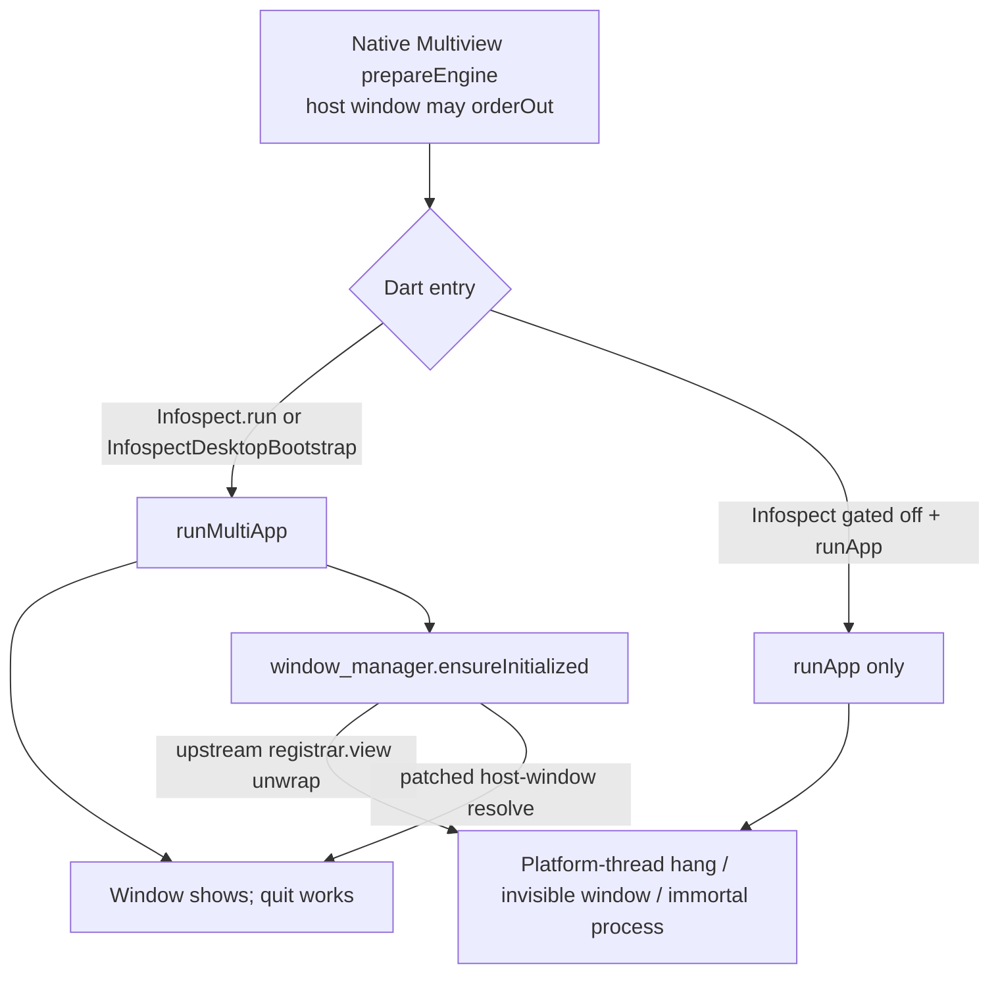

# Desktop compatibility (Multiview + host plugins)

This guide is for **host apps** that embed Infospect (or only its Multiview runners)
on macOS / Windows / Linux with [`multiview_desktop`](https://pub.dev/packages/multiview_desktop).

Infospect’s example app always calls `Infospect.instance.run` → `runMultiApp` and does
**not** depend on `window_manager`. Hosts that gate Infospect behind a feature flag,
or that use `window_manager` / other `registrar.view` plugins, hit footguns that are
easy to miss. This document captures those hazards.

See also: [MIGRATION.md](MIGRATION.md) · [README.md](README.md) · Infospect example
`macos/Runner/`.

---

## Compatibility matrix

| Component | Role | Notes |
|---|---|---|
| Infospect ≥ 0.2 | Inspector + `Infospect.run` / `bootstrapMultiViewApp` | Desktop entry uses Multiview |
| `multiview_desktop` | Native multi-view (single engine / isolate) | Required on desktop runners |
| `window_manager` (optional host dep) | Custom chrome / show-hide | **Unsafe** with Multiview unless patched — see below |
| `share_plus` (Infospect transitive) | Share sheets | Force-unwraps `registrar.view` on macOS Multiview; Infospect uses Finder/clipboard fallbacks in [`lib/utils/infospect_share.dart`](lib/utils/infospect_share.dart) |

Secondary Infospect windows share **one isolate**. There is no child-process
`multi_window` args path anymore.

---

## Always `runMultiApp` once Multiview runners are installed



After Multiview native runners are wired:

| Do | Don't |
|---|---|
| `Infospect.instance.run(...)` when the inspector is on | Plain `runApp` on desktop |
| `Infospect.bootstrapMultiViewApp(...)` / `InfospectDesktopBootstrap.runAppOrMultiApp(...)` when Infospect is **off** | Assume “no Infospect ⇒ `runApp` is fine” |
| Sequence Multiview Dart before `window_manager.ensureInitialized` | Init `window_manager` before `runMultiApp` |

### Feature-flagged Infospect

Hosts often skip `Infospect.ensureInitialized` in production. Multiview natives
still run. You **must** Multiview-bootstrap Dart anyway:

```dart
void main() {
  if (kEnableInfospect) {
    Infospect.ensureInitialized(...);
    Infospect.instance.run(const [], myApp: const MyApp());
  } else {
    // Multiview runners are still installed — do not use runApp on desktop.
    InfospectDesktopBootstrap.runAppOrMultiApp(const MyApp());
    // Same as: Infospect.bootstrapMultiViewApp(const MyApp());
  }
}
```

Predicate helpers:

```dart
InfospectDesktopBootstrap.isDesktopMultiViewRequired;
// or
isMultiViewDesktopBootstrapRequired();
```

---

## `window_manager` + Multiview hang

### Symptoms

- Launch hangs on the platform thread during `windowManager.ensureInitialized()`
- Sampled stacks stuck around `(registrar.view?.window)!` (macOS)
- Window never appears / stays invisible
- Process shows as unkillable (`UE`) in Activity Monitor; Force Quit may fail

### Root cause

Upstream `window_manager` 0.3.x resolves the primary OS window via Flutter’s
plugin `registrar.view`. Under Multiview / `enableMultiView`, that view is often
**nil** at init time. Force-unwrap / null-deref hangs or crashes the host.

Infospect does not vendor or patch `window_manager` — that is a **host**
dependency. Mitigate in the host.

### Required consumer mitigations

1. **Always Multiview-bootstrap Dart** (above) before any `window_manager` call.
2. **Never call `hiddenWindowAtLaunch` on Multiview hosts.** Multiview already
   `orderOut`s the primary window during `prepareEngine`. Double-hiding fights
   Multiview and leaves an invisible window.
3. **Patch host-window resolution** (or migrate chrome to Multiview
   `WindowOptions` / `MultiViewDesktop` APIs):
   - **macOS:** prefer resolving via `NSApp.windows` / the prepared
     `FlutterViewController`’s window — not `(registrar.view?.window)!`.
   - **Windows / Linux:** null-safe fallbacks when the registrar view is missing;
     do not dereference a null HWND / GdkWindow.
4. Prefer delaying `windowManager.ensureInitialized()` until after Multiview’s
   first frame / a host “lifecycle ready” signal.

---

## Quit / terminate lifecycle

Multiview’s macOS `AppDelegate` forwarding returns `.terminateCancel` until Dart
Multiview replies. If Dart never called `runMultiApp`, **quit never completes**
→ immortal processes.

### Failsafe pattern (host)

1. Track whether Multiview Dart is up (method channel from Dart after
   `runMultiApp`, or a short timeout).
2. Until ready, **do not** forward `applicationShouldTerminate` to Multiview —
   allow a normal terminate, or reply terminate after a timeout.
3. After ready, forward to `MultiviewDesktopPlugin` as in the Multiview README.

Minimal sketch:

```swift
// Host AppDelegate — illustrative failsafe
private var multiviewLifecycleReady = false

override func applicationShouldTerminate(_ sender: NSApplication)
    -> NSApplication.TerminateReply
{
  if !multiviewLifecycleReady {
    // Dart never started Multiview — do not cancel quit forever.
    return .terminateNow
  }
  return MultiviewDesktopPlugin.applicationShouldTerminate(sender)
}
```

Dart side (host channel) after bootstrap:

```dart
// After Infospect.run / InfospectDesktopBootstrap.runAppOrMultiApp:
await MethodChannel('your.host/multiview').invokeMethod('lifecycleReady');
```

Infospect’s example AppDelegate forwards unconditionally because its Dart entry
**always** uses Multiview. Feature-flagged hosts need the failsafe.

---

## `MainFlutterWindow` / `hiddenWindowAtLaunch`

Multiview’s sample uses:

```swift
self.setFrame(windowFrame, display: false)
```

Keep `display: false`. Multiview controls when the window orders in.

**Do not** also call `windowManager.waitUntilReadyToShow` + `hiddenWindowAtLaunch`
(or equivalent early hide) on Multiview hosts.

---

## Plugin safety (`registrar.view`)

Any method-channel plugin that force-unwraps `registrar.view` (or assumes a
single primary Flutter view) is **unsafe** with Multiview. Known cases:

| Plugin | Hazard | Infospect stance |
|---|---|---|
| `window_manager` 0.3.x | Hang / null-deref on primary window resolve | Host must patch or avoid |
| `share_plus` | Crash on macOS Multiview share | Infospect uses Finder / clipboard fallbacks |

Before adding desktop plugins, check for force-unwraps of `registrar.view` /
`FlutterView`.

---

## Menu bars — never replace the host

Infospect’s **inspector window** uses an in-window Material menu bar
(`InfospectDesktopMenuShell`). That is scoped to the Infospect view and does
**not** call `platformMenuDelegate.setMenus` or
`MultiViewDesktop.setMenuItems`.

For the **host** app:

| Approach | Effect on host menus |
|---|---|
| `InfospectInvoker` (recommended default) | Keyboard shortcut only — no menu changes |
| `InfospectDesktopInvoker(menus: hostMenus, …)` | Appends Infospect; keeps `menus` / `barButtons` |
| `InfospectDesktopInvoker.mergePlatformMenus(host)` | Insert Infospect into an existing `PlatformMenuBar` |
| `InfospectDesktopInvoker.mergeTaskbarMenus(host)` | Merge before `MultiViewDesktop.setMenuItems` (that API replaces the full list) |

Do **not** call `setMenus` / `setMenuItems` with Infospect-only items, or wrap
`InfospectDesktopInvoker` without passing the host’s existing menus.

---

## Stale `multi_window` args / second isolate

Infospect 0.1.x + `desktop_multi_window` used CLI args and a child isolate.
**Delete** host `main` branches that detect `multi_window` child processes.
Secondary windows are in-process multi-view under Infospect ≥ 0.2.

Obsolete Infospect APIs (`handleMainWindowReceiveData`, `sendNetworkCalls`, …)
are deprecated no-ops — remove call sites (see [MIGRATION.md](MIGRATION.md)).

---

## Quick checklist

- [ ] Desktop runners use Multiview `prepareEngine` / Linux runner registration
- [ ] Dart always Multiview-bootstraps on desktop (`Infospect.run` or
      `InfospectDesktopBootstrap` / `bootstrapMultiViewApp`)
- [ ] Feature-flag off path does **not** fall back to plain `runApp` on desktop
- [ ] No `hiddenWindowAtLaunch` on Multiview hosts
- [ ] `window_manager` patched or unused; init after Multiview
- [ ] Quit failsafe if terminate is forwarded before Dart Multiview is ready
- [ ] No stale `multi_window` child-isolate `main` branches
- [ ] Other plugins audited for `registrar.view` force-unwraps
- [ ] Host menus not replaced — use `InfospectInvoker`, or pass host menus into
      `InfospectDesktopInvoker` / `merge*Menus` helpers
