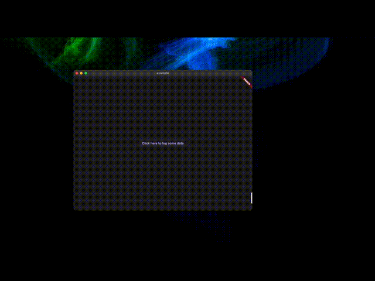
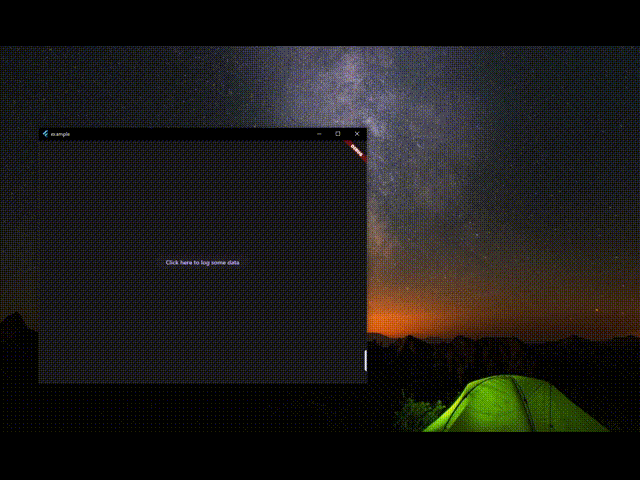

# Overview

Infospect meaning Information Inspector is a Flutter plugin for that empowers the developers to
debug the network calls and logs in the app. It is a powerful tools that offer network call
interception and logging features, among others. By allowing developers to monitor and intercept
network calls, they can efficiently debug network-related issues and optimize app performance. The
logging and debugging capabilities aid in understanding app behavior and detecting errors, leading
to faster bug resolution.

## Preview

##### iOS

##### macOS - Opening Infospect in new Window

##### Linus (Ubuntu VM in mac)- Opening Infospect in new Window
.gif)
##### Window 10 - (VM in mac) - Opening Infospect in new Window


## Getting started

1. Add the dependency to your pubspec.yaml file. (Replace latest-version with the latest version of
   the plugin)

  ```yaml
  dependencies:
    infospect: latest-version
  ```

or using the below command

  ```console
  flutter pub add infospect
  ```

## Usage

1. Adding args to main, to enable the support of multi window. Plugin used for
   this [https://pub.dev/packages/desktop_multi_window](https://pub.dev/packages/desktop_multi_window)

  ```dart
  void main(List<String> args) {}
  ```

2. Initialize the plugin in main.dart

  ```dart
    WidgetsFlutterBinding.ensureInitialized();
    Infospect.ensureInitialized();
  ```

In ensureInitialized we can configure the maxCallCount `int` for both network calls and logs,
defaults to 1000.
A navigatorKey `GlobalKey<NavigatorState>` that will be used for navigation and dialog, if not
provided a new key will be created.
A bool value to logAppLaunch, if true will log the app launch with details like below, defaults to
true,

  ```
  App name:  Example
  Package: com.example.example
  Version: 0.1.0
  Build number: 0.1.0
  Started at: 2023-08-20T13:39:56.531974
  ```

A call back to handle the share functionality for all the network calls `onShareAllNetworkCalls`,
This will provide the path of the compressed file name infospect_network_calls_log.tar.gz, which can
be shared accordingly.
If not provided, the default platform share option will be invoked.

A call back to handle the share functionality for all the logs `onShareAllLogs`,
This will provide the path of the compressed file name infospect_logs.tar.gz, which can be shared
accordingly.
If not provided, the default platform share option will be invoked.

3. As in desktop a new window is used to show the infospect window, we need to add the following
   code in main.dart, as this will help to handle the data received to the main window from the
   infospect window.
  ```dart
    Infospect.ensureInitialized();
    Infospect.instance.handleMainWindowReceiveData();
  ```

else can be also combined with ensureInitialized
  ```dart
    Infospect.ensureInitialized(logAppLaunch: true).handleMainWindowReceiveData()
  ```

4. Rather using runApp using, use `Infospect.instance.run(args, myApp: EntryWidget())`;
   This will help to set the args and use it when launching the infospect window in Desktop
  ```dart
    Infospect.instance.run(args, myApp: const MainApp());
  ```
5. Adding network call interceptor
   a. dio:
  ```dart
    _dio = Dio(BaseOptions());
    _dio.interceptors.add(Infospect.instance.dioInterceptor);
  ```
   b. http:
  ```dart
    http.Client client = http.Client();
    client = Infospect.instance.httpClientInterceptor(client: client);
  ```
6. Adding logs
  ```dart
    Infospect.instance.addLog(
      InfospectLog(
        message: logMessage,
        level: level,
        error: error,
        stackTrace: stackTrace,
      ),
    );
  ```

## Upcoming Feature

1. Breakpoints for network call to edit request and response.
2. Add support for more network client.
3. Sorting of the logs and network calls.
4. An example app with multiple screen and good number of network calls and logs.
5. Bug fixes and many more.

** the above order is based on the priority of the feature and the working being done on it.

## Support

This plugin is free to use and currently in its early stages of development. We plan to add many
more features soon. Please visit
the [Github Project](https://github.com/users/kushalmahapatro/projects/2) to know about the upcoming
feature and fixes. If you encounter any issues or would like additional features, please raise an
issue in the [GitHub repository](https://github.com/kushalmahapatro/infospect/issues).

Feel free to contribute to this project by creating a pull request with a clear description of your
changes.

If this plugin was useful to you, helped you in any way, saved you a lot of time, or you just want
to support the project, I would be very grateful if you buy me a cup of coffee. Your support helps
maintain and improve this project.


<a href="https://www.buymeacoffee.com/kushalm" target="_blank"></a>